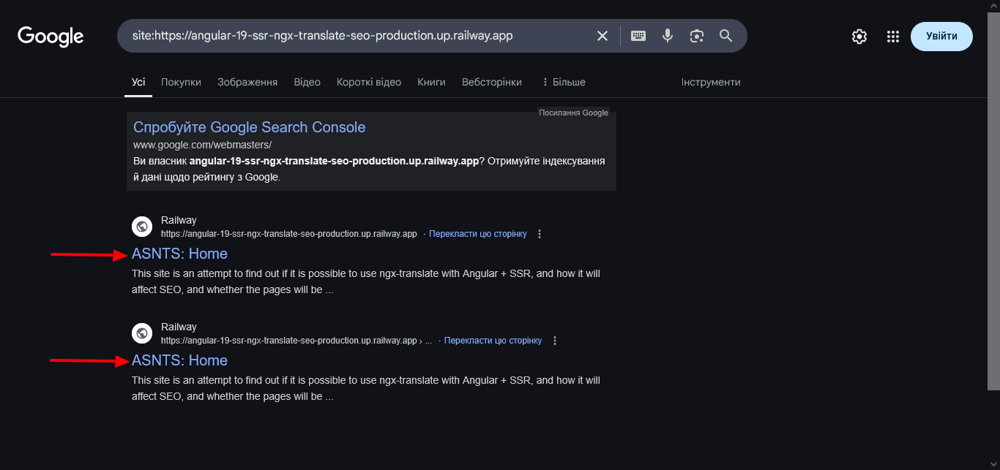
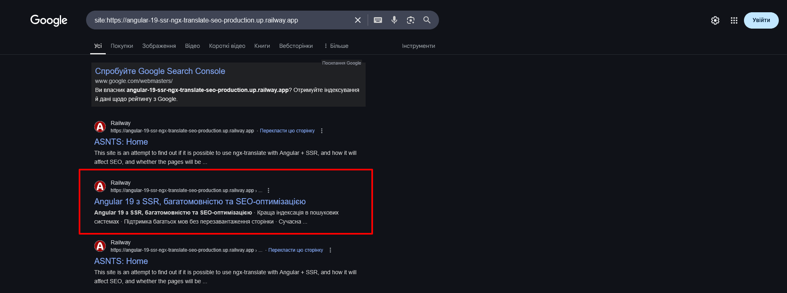

# Angular + SSR + Ngx-translate + SEO <!-- omit in toc -->

Цей проєкт було створено за допомогою [Angular CLI](https://github.com/angular/angular-cli) версії 19.2.5.

<p style="color:orange">Це не інструкція того як потрібно створювати сайти!
Це просто покроковий перелік дій які я робив під час створення цього тестового проекту!</p>

На даний момент я не крутий розробник, який може показати комусь, як робити проекти для продакшену. Я сам ще навчаюся і намагаюся розібратися в різних технологіях, зрозуміти, що і як працює, а що ні. І це досить складно зробити, коли один "senior" каже - це працює, а інший каже - ні, це не працює. Кому вірити? Залишається лише взяти і зробити подібні проекти і самостійно з'ясувати, де правда. Так, я переконаний, що в цьому проекті багато помилок, поганих практик, жахливий "readme", але цей проект був для мене гарною практикою і він дасть відповідь на питання: чи індексуються сторінки з ngx-translate та SSR?

🌐 Доступні мови:

- 🇺🇦 [Українська](README.uk.md)
- 🇺🇸 [English](README.md)

## Вступ<!-- omit in toc -->

Це друга частина проєкту [Angular-19-SSR-ngx-translate
](https://github.com/One-LifeMan/Angular-19-SSR-ngx-translate), що базується на першій частині та включає методи SEO-оптимізації.

Ця частина охоплює основні елементи SEO, зокрема:

- Favicons
- Метатеги
- Структуровані дані
- sitemap.xml
- robots.txt
- Інтеграція з Google Analytics

**Зміст:** <!-- omit in toc -->

## 1. Favicons

### 1.1. Створити фавіконки

Існують різні генератори фавіконок та рекомендації щодо форматів і розмірів. У цьому проєкті використовується така конфігурація:

<!-- prettier-ignore -->
```md
└── 📁public
  └── 📁favicon
    └── apple-touch-icon.png
    └── favicon-16x16.png
    └── favicon-32x32.png
    └── favicon-48x48.png
    └── favicon-96x96.png
    └── favicon.ico
    └── favicon.svg
    └── safari-pinned-tab.svg
    └── web-app-manifest-192x192.png
    └── web-app-manifest-512x512.png
  └── site.webmanifest
```

### 1.2. Оновити index.html

**src\index.html**

```html
<!-- Favicons -->
<link href="/favicon/apple-touch-icon.png" rel="apple-touch-icon" sizes="180x180" />
<link href="/favicon/favicon-96x96.png" type="image/png" rel="icon" sizes="96x96" />
<link href="/favicon/favicon-48x48.png" type="image/png" rel="icon" sizes="48x48" />
<link href="/favicon/favicon-32x32.png" type="image/png" rel="icon" sizes="32x32" />
<link href="/favicon/favicon-16x16.png" type="image/png" rel="icon" sizes="16x16" />
<link href="/site.webmanifest" rel="manifest" />
<link href="/favicon/safari-pinned-tab.svg" color="#a00000" rel="mask-icon" />
<link href="/favicon/favicon.ico" rel="shortcut icon" />

<meta name="msapplication-TileColor" content="#a00000" />
<meta name="theme-color" content="#ccc" media="(prefers-color-scheme: light)" />
<meta name="theme-color" content="#191919" media="(prefers-color-scheme: dark)" />
```

### 1.3. Додати site.webmanifest

```bash
touch public/site.webmanifest
```

Налаштуйте site.webmanifest як завгодно. У мене це так:
Більше інформації про webmanifest на [W3C spec](https://www.w3.org/TR/appmanifest/)

**public\site.webmanifest**

```json
{
  "lang": "en-US",
  "name": "Angular v19 + SSR + ngx-translate + SEO",
  "name_localized": {
    "uk": { "value": "Angular v19 + SSR + ngx-translate + SEO", "dir": "rtl" }
  },
  "short_name": "ASNTS",
  "short_name_localized": {
    "uk": { "value": "ASNTS", "dir": "rtl" }
  },
  "icons": [
    {
      "src": "/favicon/web-app-manifest-192x192.png",
      "sizes": "192x192",
      "type": "image/png",
      "purpose": "maskable"
    },
    {
      "src": "/favicon/web-app-manifest-512x512.png",
      "sizes": "512x512",
      "type": "image/png",
      "purpose": "maskable"
    }
  ],
  "theme_color": "#ffffff",
  "background_color": "#a00000",
  "display": "standalone",
  "start_url": "/",
  "description": "This site is an attempt to find out if it is possible to use ngx-translate with Angular + SSR, and how it will affect SEO, and whether the pages will be indexed.",
  "description_localized": {
    "uk": {
      "value": "Цей сайт є спробою з'ясувати чи можливо використовувати ngx-translate з Angular + SSR, та як це вплине на SEO, з'ясувати чи будуть індексуватись сторінки.",
      "dir": "rtl"
    }
  },
  "categories": ["Angular", "SSR", "ngx-translate", "translate", "SEO"],
  "screenshots": [
    {
      "src": "/screenshots/screenshot1.webp",
      "sizes": "540x720",
      "type": "image/webp",
      "form_factor": "narrow"
    },
    {
      "src": "/screenshots/screenshot2.webp",
      "sizes": "540x720",
      "type": "image/webp"
    },
    {
      "src": "/screenshots/screenshot3.webp",
      "sizes": "1280x720",
      "type": "image/webp",
      "form_factor": "narrow"
    },
    {
      "src": "/screenshots/screenshot4.webp",
      "sizes": "1280x720",
      "type": "image/webp"
    },
    {
      "src": "/screenshots/screenshot5.png",
      "sizes": "1920x1080",
      "type": "image/png",
      "form_factor": "narrow"
    },
    {
      "src": "/screenshots/screenshot6.png",
      "sizes": "1920x1080",
      "type": "image/png"
    }
  ]
}
```

## 2. SEO сервіс

**Важливе застереження:**

Я новачок у SEO, і моє розуміння все ще розвивається. Наведена нижче реалізація є базовим прикладом і не повинна розглядатися як вичерпний посібник з найкращих практик SEO. Вона демонструє фундаментальні методи для конкретних потреб цього проєкту. Щоб отримати глибокі знання про SEO, зверніться до спеціалізованих ресурсів та експертів.

### 2.1. Створити SEO сервіс

```bash
ng g s services/seo
```

### 2.2. Оновити глобальний атрибут - lang

Створимо наступний метод у сервісі SEO:

**src\app\services\seo.service.ts**

```ts
@Injectable({
  providedIn: "root",
})
export class SeoService {
  private readonly document = inject(DOCUMENT);
  private readonly translate = inject(TranslateService);

  private changeHtmlLang() {
    this.document.documentElement.lang = this.translate.currentLang;
  }
}
```

### 2.3. Оновити метатеги

Щоб оновити метатеги, ми створимо наступний метод:
**src\app\services\seo.service.ts**

```ts
  private readonly DEFAULT_IMAGE = `${environment.appUrl}images/ng-image.jpg`;
  private readonly titleService = inject(Title);
  private readonly meta = inject(Meta);
  private currentUrl = "";

```

```ts
  private updateMetaTags(title: string, description: string, image: string = this.DEFAULT_IMAGE) {
    this.titleService.setTitle(title);

    this.meta.updateTag({ name: "description", content: description });
    this.meta.updateTag({ property: "og:title", content: title });
    this.meta.updateTag({ property: "og:description", content: description });
    this.meta.updateTag({ property: "og:type", content: "website" });
    this.meta.updateTag({ property: "og:image", content: image });
    this.meta.updateTag({ property: "twitter:card", content: "summary" });
    this.meta.updateTag({ property: "twitter:title", content: title });
    this.meta.updateTag({ property: "twitter:description", content: description });
    this.meta.updateTag({ property: "twitter:image", content: image });
    this.meta.updateTag({ name: "canonical", content: this.currentUrl });
  }
```

Щоб отримати значення currentUrl, ми створимо метод:

```ts
  private readonly router = inject(Router);
```

```ts
  private getCurrentUrl() {
    const appUrl = environment.appUrl;
    const currentUrl = appUrl + this.router.url.slice(1);
    return currentUrl;
  }
```

### 2.4. Додати та оновлювати структуровані дані:

Структуровані дані допомагають пошуковим системам зрозуміти вміст ваших сторінок.

Більше про це можна дізнатись тут: [schema.org](https://schema.org/docs/documents.html)

```bash
touch src/types/jsonld.types.ts
```

**src\types\jsonld.types.ts**

```ts
export interface JsonLdTypes {
  Product: "Product";
  WebSite: "WebSite";
  AboutPage: "AboutPage";
  CollectionPage: "CollectionPage";
}

export type JsonLdKeys = keyof JsonLdTypes;

export interface JsonLdInput {
  "@type": JsonLdKeys;
  image?: string;
  datePublished?: string;
  dateModified?: string;
}

export interface JsonLd extends JsonLdInput {
  "@context": string;
  name: string;
  description: string;
  url: string;
}
```

**src\app\services\seo.service.ts**

```ts
  private readonly renderFactory = inject(RendererFactory2);
  private readonly render: Renderer2;

    constructor() {
    this.render = this.renderFactory.createRenderer(null, null);
  }
```

Схоже, що `Renderer2` не працює на стороні сервера. Тому мені довелося зробити це через `RendererFactory2`.

**src\app\services\seo.service.ts**

```ts
  private updateJsonLd(jsonLd: JsonLdInput, name: string, description: string) {
    const existingScript = this.document.querySelector(
      "script[type='application/ld+json']#json-ld-script",
    );

    const enrichedJsonLd: JsonLd = {
      "@context": "https://schema.org",
      name: name,
      description: description,
      url: this.currentUrl,
      image: this.DEFAULT_IMAGE,
      ...jsonLd,
    };

    if (existingScript) {
      existingScript.textContent = JSON.stringify(enrichedJsonLd);
    } else {
      this.addJsonLd(enrichedJsonLd);
    }
  }

  private addJsonLd(jsonLd: JsonLd) {
    const script = this.document.createElement("script");
    script.type = "application/ld+json";
    script.id = "json-ld-script";
    script.textContent = JSON.stringify(jsonLd);
    this.render.appendChild(this.document.head, script);
  }
```

### 2.5. Створення методу updateSeo

Усі методи, створені до цього, є приватними. Тому нам потрібен ще один публічний метод, який ми й використовуватимемо.

```bash
touch src/types/seo.types.ts
```

**src\types\seo.types.ts**

```ts
export interface SeoOptions {
  key: string;
  jsonLd: JsonLdInput;
  params?: Record<string, string>;
}
```

**src\app\services\seo.service.ts**

```ts
interface TranslateResponse {
  title: string;
  description: string;
}
```

```ts
updateSeo(options: SeoOptions) {
    this.currentUrl = this.getCurrentUrl();

    this.changeHtmlLang();

    this.translate
      .get(`META.${options.key}`, options.params)
      .pipe(take(1))
      .subscribe({
        next: (translations: TranslateResponse) => {
          const { title, description } = translations;
          const image = options.jsonLd.image;
          this.updateMetaTags(title, description, image);

          this.updateJsonLd(options.jsonLd, title, description);
        },
        error: err => {
          console.error("Error updating SEO:", err);
        },
      });
  }
```

Метод updateSeo приймає об'єкт, що містить:
`key` - який служить ключем для пошуку перекладених рядків;
`jsonLd` - об'єкт з даними для створення скрипта зі структурованими даними;
`params` (необов'язково) - об'єкт, що містить значення параметрів для інтерполяції в перекладених рядках. Він нам знадобиться трохи пізніше;

## 3. Оновити сторінки

**src\types\seo.types.ts**

```ts
export enum SeoKeysEnum {
  Home = "HOME",
  About = "ABOUT",
  Products = "PRODUCTS",
  ProductsDetails = "PRODUCTS_DETAILS",
  NotFound = "404",
}
```

**src\app\pages\client\home\home.component.ts**

```ts
@Component({
  selector: "app-home",
  imports: [TranslatePipe],
  templateUrl: "./home.component.html",
  styleUrl: "./home.component.scss",
})
export class HomeComponent implements OnInit, OnDestroy {
  private destroy$ = new Subject<void>();
  private readonly seo = inject(SeoService);
  translate = inject(TranslateService);

  ngOnInit(): void {
    const jsonLd: JsonLdInput = { "@type": "WebSite" };
    const seoOptions: SeoOptions = { key: SeoKeysEnum.Home, jsonLd };

    this.seo.updateSeo(seoOptions);

    this.translate.onLangChange.pipe(takeUntil(this.destroy$)).subscribe(() => {
      this.seo.updateSeo(seoOptions);
    });
  }

  ngOnDestroy(): void {
    this.destroy$.next();
    this.destroy$.complete();
  }
}
```

Ми запускаємо метод `seo.updateSeo` під час ініціалізації компонента, а також під час зміни мови — щоб метатеги та інші дані були поточною мовою.

Це потрібно повторити в AboutComponent та NotFoundPageComponent.

### 3.1. Оновити файли перекладу

**public\i18n\en.json**

```json
  "META": {
    "HOME": {
      "title": "Home | ASNTS",
      "description": "This site is an attempt to find out if it is possible to use ngx-translate with Angular + SSR, and how it will affect SEO, and whether the pages will be indexed."
    },
    "ABOUT": {
      "title": "About | ASNTS",
      "description": "This is a test page about us."
    },
    "404": {
      "title": "404 | ASNTS",
      "description": "This page is not found."
    }
  },
```

**public\i18n\uk.json**

```json
  "META": {
    "HOME": {
      "title": "Головна | ASNTS",
      "description": "Цей сайт є спробою з'ясувати чи можливо використовувати ngx-translate з Angular + SSR, та як це вплине на SEO, з'ясувати чи будуть індексуватись сторінки."
    },
    "ABOUT": {
      "title": "Про нас | ASNTS",
      "description": "Це тестова сторінка про нас."
    },
    "404": {
      "title": "404 | ASNTS",
      "description": "Ця сторінка не знайдена."
    }
  },
```

## 4. Додати сторінки з динамічними даними

### 4.1. Створити дані

**src\types\products.types.ts**

```ts
export interface ServerProduct {
  id: number;
  name: Record<string, string>;
  slug: string;
  description: Record<string, string>;
  metaDesc: Record<string, string>;
  price: number;
  color: string;
  src: string | null;
  createdAt: string;
  updatedAt: string;
}

export interface Product {
  id: number;
  name: string;
  slug: string;
  description: string;
  metaDesc: string;
  price: number;
  color: string;
  src: string | null;
  createdAt: string;
  updatedAt: string;
}
```

ServerProduct - у цьому вигляді дані зберігаються на сервері;
Product - у цьому вигляді відправляються на клієнт;

**Увага! Це тестовий проєкт, тому я не використовуватиму базу даних, а просто зберігатиму масив даних на сервері.**

**src\server\mock\products.mock.ts**

```ts
import { Product, ServerProduct } from "src/types/products.types";

export const serverProducts: Array<ServerProduct> = [
  {
    id: 1,
    name: { en: "Apple", uk: "Яблуко" },
    slug: "apple",
    description: { en: "Fresh and juicy apple", uk: "Свіже та соковите яблуко" },
    metaDesc: { en: "Buy fresh apples", uk: "Купуйте свіжі яблука" },
    price: 1.2,
    color: "red",
    src: "v1744617529/apples_hd9yit.png",
    createdAt: new Date("2023-10-01T12:00:00Z").toISOString(),
    updatedAt: new Date("2023-10-01T12:00:00Z").toISOString(),
  },
  {
    id: 2,
    name: { en: "Pear", uk: "Груша" },
    slug: "pear",
    description: { en: "Sweet and delicious pear", uk: "Солодка та смачна груша" },
    metaDesc: { en: "Buy sweet pears", uk: "Купуйте солодкі груші" },
    price: 1.5,
    color: "green",
    src: "v1744617529/pears_g18zef.png",
    createdAt: new Date("2024-10-01T12:00:00Z").toISOString(),
    updatedAt: new Date("2024-10-01T12:00:00Z").toISOString(),
  },
  {
    id: 3,
    name: { en: "Plum", uk: "Слива" },
    slug: "plum",
    description: { en: "Ripe and tasty plum", uk: "Стигла та смачна слива" },
    metaDesc: { en: "Buy ripe plums", uk: "Купуйте стиглі сливи" },
    price: 1.8,
    color: "purple",
    src: "v1744617529/plums_nkpac0.png",
    createdAt: new Date("2025-03-01T12:00:00Z").toISOString(),
    updatedAt: new Date("2025-03-01T12:00:00Z").toISOString(),
  },
  {
    id: 4,
    name: { en: "Orange", uk: "Апельсин" },
    slug: "orange",
    description: { en: "Citrusy and refreshing orange", uk: "Цитрусовий та освіжаючий апельсин" },
    metaDesc: { en: "Buy fresh oranges", uk: "Купуйте свіжі апельсини" },
    price: 2.0,
    color: "orange",
    src: "v1744617529/oranges_zy3pcb.png",
    createdAt: new Date("2025-04-01T12:00:00Z").toISOString(),
    updatedAt: new Date("2025-04-01T12:00:00Z").toISOString(),
  },
  {
    id: 5,
    name: { en: "Banana", uk: "Банан" },
    slug: "banana",
    description: { en: "Soft and sweet banana", uk: "М'який та солодкий банан" },
    metaDesc: { en: "Buy fresh bananas", uk: "Купуйте свіжі банани" },
    price: 1.3,
    color: "yellow",
    createdAt: new Date("2025-04-10T12:00:00Z").toISOString(),
    updatedAt: new Date("2025-04-10T12:00:00Z").toISOString(),
    src: null,
  },
];
```

Також одразу додамо методи для отримання всіх продуктів та для отримання одного конкретного продукту.

```ts
export const getAllProducts = (language: string) => {
  const products = serverProducts.map(p => {
    const product: Product = {
      ...p,
      name: p.name[language],
      description: p.description[language],
      metaDesc: p.metaDesc[language],
    };
    return product;
  });

  return products;
};

export const getProductBySlug = (slug: string, language: string) => {
  const serverProduct = serverProducts.find(p => p.slug === slug);

  if (!serverProduct) {
    return null;
  }
  const product: Product = {
    ...serverProduct,
    name: serverProduct.name[language],
    description: serverProduct.description[language],
    metaDesc: serverProduct.metaDesc[language],
  };

  return product;
};
```

Як бачимо, деякі поля в продуктах мають переклади (назва, опис, метаопис).
Є два варіанти:

- можна надсилати дані з усіма перекладами та вже на клієнті відображати інформацію потрібною мовою.

- надсилати дані однією мовою, яку користувач наразі використовує.

Кожен з варіантів має переваги та недоліки. Я обрав другий варіант, щоб торкнутися іншої теми - отримання мови користувача на сервері.

### 4.2. Налаштувати i18next на сервері

#### 4.2.1. Встановити залежності

```bash
pnpm add i18next i18next-fs-backend i18next-http-middleware
```

#### 4.2.2. Створити конфігураційний файл

```bash
touch src/server/core/i18next-config.ts
```

**src\server\core\i18next-config.ts**

```ts
import { Express } from "express";
import i18next, { InitOptions } from "i18next";
import Backend, { FsBackendOptions } from "i18next-fs-backend/cjs";
import * as middleware from "i18next-http-middleware";
import path from "node:path";
import { environment } from "src/environments/environment";

const i18nextConfig = (serverDistFolder: string, app: Express) => {
  const fsBackendOptions: FsBackendOptions = {
    loadPath: path.join(serverDistFolder, "locales/{{lng}}/{{ns}}.json"),
    addPath: path.join(serverDistFolder, "locales/{{lng}}/{{ns}}.missing.json"),
  };

  const detectorOptions: middleware.LanguageDetectorOptions = {
    order: ["querystring", "cookie", "header"],
    caches: ["cookie"],
    lookupCookie: "i18next",
    lookupQuerystring: "lng",
    convertDetectedLanguage: lng => lng.split("-")[0],
    cookieExpirationDate: new Date(Date.now() + 60 * 60 * 1000), // 1 hour
  };

  const i18nextOptions: InitOptions = {
    initImmediate: false,
    fallbackLng: environment.languages[0],
    preload: environment.languages,
    ns: ["messages"],
    debug: false,
    backend: fsBackendOptions,
    detection: detectorOptions,
    supportedLngs: environment.languages,
    nonExplicitSupportedLngs: true,
    load: "languageOnly",
  };

  i18next.use(Backend).use(middleware.LanguageDetector).init(i18nextOptions);

  app.use(middleware.handle(i18next));
};

export default i18nextConfig;
```

Більше про налаштування читайте в офіційній документації:
[i18next](https://www.i18next.com/)
[i18next-fs-backend](https://github.com/i18next/i18next-fs-backend)
[i18next-http-middleware](https://github.com/i18next/i18next-http-middleware)

**Попередження! На мою думку, властивість `load: "languageOnly"` в `i18nextOptions` не працює, тому в `detectorOptions` я додав `convertDetectedLanguage: lng => lng.split("-")[0]`, щоб отримати 'en' з 'en-US'.**

#### 4.2.3. Додати файли перекладів для i18next

```bash
mkdir src/server/locales
mkdir src/server/locales/en
mkdir src/server/locales/uk
touch src/server/locales/en/messages.json
touch src/server/locales/uk/messages.json
```

**src\server\locales\en\messages.json**

```json
{
  "NOT_FOUND": "Product with slug: {{slug}} not found"
}
```

**src\server\locales\uk\messages.json**

```json
{
  "NOT_FOUND": "Продукт з slug: {{slug}} не знайдено"
}
```

#### 4.2.4. Імпорт та підключення конфігурації i18next

**src\server.ts**

```ts
import i18nextConfig from "./server/core/i18next-config";
```

```ts
i18nextConfig(serverDistFolder, app);
```

#### 4.2.5. Налаштувати запити

Повертаючись до ngx-translate та ngx-translate-router:
Уявімо ситуацію: користувач спочатку відвідує сайт за посиланням `http://localhost:4000` (тобто мова не вказана), сторінка має бути згенерована на сервері, АЛЕ! яку мову має обрати `ngx-translate`? Ту, яку передасть `ngx-translate-router`, але `ngx-translate-router` у нашому випадку не може визначити мову, оскільки сервер не має доступу до localStorage, а мова не була передана в url. Тому буде використана мова за замовчуванням, у нашому випадку "en". Але після завантаження сторінки в браузері `ngx-translate-router` визначить мову з localStorage, або браузера (у нашому випадку це "uk"), передасть її до `ngx-translate`, а той у свою чергу завантажить файл з перекладами та оновить текст на сторінці. Це погано. Нам потрібно, щоб користувач одразу отримав сторінку своєю мовою. Ми вже можемо визначити мову користувача на сервері, оскільки ми налаштували i18next. Все, що нам потрібно зробити, це передати її до `ngx-translate-router`, і для цього ми зробимо простий запит:
**src\server.ts**

```ts
app.get("/", (req, res) => {
  const lang = req.language;
  res.redirect(301, `/${lang}`);
});
```

Додамо ще два запити, які повертають продукти:

**src\server.ts**

```ts
app.get("/api/products", (req, res) => {
  const language = req.language;
  const products = getAllProducts(language);
  res.json(products);
});

app.get("/api/products/:slug", (req, res) => {
  const slug = req.params.slug;
  const language = req.language;

  const product = getProductBySlug(slug, language);

  if (!product) {
    res.status(404).send(req.t(`messages:NOT_FOUND`, { replace: { slug } }));
  } else {
    res.json(product);
  }
});
```

#### 4.2.6. Оновити файли cookie під час зміни мови

Ще один важливий момент полягає в тому, що i18next (точніше i18next-http-middleware) зберігає мову в "cookie" з ключем "i18next", і якщо він не може отримати мову з "path" або "querystring", то він спробує отримати мову з "cookie". АЛЕ! Коли користувач змінює мову на сайті (у нашому випадку за це відповідає "LanguageSwitcherComponent"), то ngx-translate-router зберігає/оновлює дані в localStorage з ключем "LOCALIZE_DEFAULT_LANGUAGE", але мова в "cookie" не зміниться! І тому, в певних випадках, i18next та ngx-translate-router можуть розглядати поточну мову як дві різні мови. Тому необхідно оновлювати мову в "cookie", коли користувач змінює мову. Давайте зробимо це.

**Встановити пакет для зручної роботи з файлами cookie**

```bash
pnpm add ngx-cookie-service-ssr
```

Власне, існує також звичайна версія: `ngx-cookie-service` — без підтримки SSR. Враховуючи, що ми будемо використовувати цю бібліотеку лише в браузері, можна було б встановити її, але я вирішив встановити SSR-версію.

**src\app\app.component.ts**

```ts
import { Component, inject } from "@angular/core";
import { RouterOutlet } from "@angular/router";
import { TranslateService } from "@ngx-translate/core";
import { SsrCookieService } from "ngx-cookie-service-ssr";

@Component({
  selector: "app-root",
  imports: [RouterOutlet],
  templateUrl: "./app.component.html",
  styleUrl: "./app.component.scss",
})
export class AppComponent {
  private readonly translate = inject(TranslateService);
  private readonly cookieService = inject(SsrCookieService);

  constructor() {
    this.translate.onLangChange.subscribe(langeEvent => {
      this.saveLangInCookie(langeEvent.lang);
    });
  }

  saveLangInCookie(lang: string) {
    this.cookieService.set("i18next", lang, 365, "/");
  }
}
```

#### 4.2.7. Оновити package.json

Варто додати скрипт "postbuild" для автоматичного копіювання теки `src/server/locales` до `dist/angular-ssr-ngx-translate/server/` після виконання "build".

```json
{
  "name": "angular-ssr-ngx-translate",
  "version": "0.0.0",
  "scripts": {
    "postbuild": "cp -r src/server/locales dist/angular-ssr-ngx-translate/server/",
    ...
  }
  ...
}
```

### 4.3. Створити ProductsService

```bash
ng g s services/products
```

**src\app\services\products.service.ts**

```ts
import { HttpClient } from "@angular/common/http";
import { inject, Injectable } from "@angular/core";
import { Observable } from "@app/rxjs";
import { TranslateService } from "@ngx-translate/core";
import { environment } from "src/environments/environment";
import { Product } from "src/types/products.types";

@Injectable({
  providedIn: "root",
})
export class ProductsService {
  private baseUrl = environment.appUrl;
  private readonly http = inject(HttpClient);
  private readonly translate = inject(TranslateService);

  findAll(): Observable<Array<Product>> {
    return this.http.get<Array<Product>>(`${this.baseUrl}api/products`, {
      params: { lng: this.translate.currentLang },
    });
  }

  findBySlug(slug: string): Observable<Product> {
    return this.http.get<Product>(`${this.baseUrl}api/products/${slug}`, {
      params: { lng: this.translate.currentLang },
    });
  }
}
```

**Why do I pass the language in params?**

**Чому я передаю мову в параметрах?**

Тому що якщо ми перейдемо за прямим посиланням, наприклад: `http://localhost:4000/uk/products/apple`, сторінка буде згенерована на стороні сервера, і відповідно запит `findBySlug("apple")` буде виконано на стороні сервера, і в цьому випадку `i18next-http-middleware` не зможе визначити мову та встановить мову за замовчуванням.

Водночас, якщо ми перейдемо з іншої сторінки `http://localhost:4000/uk/products` => `http://localhost:4000/uk/products/apple`, то все буде добре, оскільки запит було зроблено в браузері, а не на стороні сервера.

Примітка: HTTP-перехоплювач може автоматизувати додавання параметра мови до запитів. Дивіться документацію Angular для отримання додаткової інформації: [Докладніше про перехоплювачі](https://angular.dev/guide/http/interceptors)

### 4.4. Налаштувати Cloudinary

Зображення потрібно десь зберігати. Я обрав сервіс https://cloudinary.com
Ви могли помітити, що дані `ServerProduct` та `Product` мають поля `src` з подібними значеннями: "v1744617529/apples_hd9yit.png". Це назви зображень. Точніше, "v1744617529" – це тека на cloudinary, в якій знаходиться зображення, а "apples_hd9yit.png" – це сама назва.

Щоб скористатися цим сервісом, зробимо наступне:

#### 4.4.1. Оновити середовища

**src\environments\environment.ts**
**src\environments\environment.watch.ts**
**src\environments\environment.development.ts**

```json
  cloudinary: "https://res.cloudinary.com/det0m1i3y",
  placeholderImg: "v1744642967/placeholder_w468jr.png",

```

#### 4.4.2. Оновити app.config.ts

Увага! Оскільки я використовуватиму NgOptimizedImage, мені потрібно додати provideCloudinaryLoader.
Якщо ви використовуєте інший сервіс, перевірте, чи підтримує він NgOptimizedImage.
[Детальніше про NgOptimizedImage](https://angular.dev/guide/image-optimization)
[Детальніше про підтримувані сервіси](https://angular.dev/guide/image-optimization#configuring-an-image-loader-for-ngoptimizedimage)

**src\app\app.config.ts**

```ts
import { environment } from "src/environments/environment";
```

```ts
provideCloudinaryLoader(environment.cloudinary),
```

### 4.5. Створити сторінку товарів

```bash
ng g c pages/client/products
```

Код у компоненті не сильно відрізняється від інших сторінок, окрім того, що під час ініціалізації та після зміни мови було додано виклик методу `this.prodService.findAll()`.

**src\app\pages\client\products\products.component.ts**

```ts
import { AsyncPipe, NgOptimizedImage } from "@angular/common";
import { Component, inject, OnInit, OnDestroy } from "@angular/core";
import { RouterLink } from "@angular/router";
import { Observable, Subject, takeUntil } from "@app/rxjs";
import { LocalizeRouterPipe } from "@gilsdav/ngx-translate-router";
import { TranslatePipe, TranslateService } from "@ngx-translate/core";
import { ProductsService } from "src/app/services/products.service";
import { SeoService } from "src/app/services/seo.service";
import { environment } from "src/environments/environment";
import { JsonLdInput } from "src/types/jsonld.types";
import { Product } from "src/types/products.types";
import { SeoKeysEnum, SeoOptions } from "src/types/seo.types";

@Component({
  selector: "app-products",
  imports: [TranslatePipe, RouterLink, LocalizeRouterPipe, AsyncPipe, NgOptimizedImage],
  templateUrl: "./products.component.html",
  styleUrl: "./products.component.scss",
})
export class ProductsComponent implements OnInit, OnDestroy {
  private destroy$ = new Subject<void>();

  private readonly prodService = inject(ProductsService);
  private readonly seo = inject(SeoService);
  private readonly translate = inject(TranslateService);

  products$: Observable<Array<Product>> | null = null;
  placeholderImg = environment.placeholderImg;

  ngOnInit(): void {
    const jsonLd: JsonLdInput = { "@type": "CollectionPage" };
    const seoOptions: SeoOptions = { key: SeoKeysEnum.Products, jsonLd };

    this.products$ = this.prodService.findAll();
    this.seo.updateSeo(seoOptions);

    this.translate.onLangChange.pipe(takeUntil(this.destroy$)).subscribe(() => {
      this.products$ = this.prodService.findAll();
      this.seo.updateSeo(seoOptions);
    });
  }

  ngOnDestroy(): void {
    this.destroy$.next();
    this.destroy$.complete();
  }
}
```

**src\app\pages\client\products\products.component.html**

```html
<p>{{ "CONTENT.PRODUCTS" | translate }}</p>

<section class="products">
  <ul class="products__list">
    @for (product of products$ | async; track product.id) {
    <li class="products__item">
      <h2 class="products__title">{{ product.name }}</h2>
      <h3 class="products__title">Slug: {{ product.slug }}</h3>
      
      <a class="products__link" [routerLink]="['/products/' + product.slug | localize]">
        {{ "BTNS.DETAILS" | translate }}
      </a>
    </li>
    }
  </ul>
</section>
```

**src\app\pages\client\products\products.component.scss**

```scss
.products {
  margin: 20px 0;

  &__list {
    display: flex;
    flex-wrap: wrap;
    gap: var(--gap-medium);
    justify-content: space-evenly;
  }

  &__item {
    display: flex;
    flex-direction: column;
    gap: var(--gap-medium);
    align-items: center;
    max-width: 200px;
    padding: var(--gap-medium);
    color: var(--on-secondary-color);
    background-color: var(--secondary-color);
    border-radius: var(--gap-medium);
  }

  &__title {
  }

  &__img {
    display: block;
    width: 100%;
    height: auto;
    aspect-ratio: 16/9;
    border-radius: var(--gap-medium);
    object-fit: cover;
  }

  &__link {
    display: flex;
    align-items: center;
    justify-content: center;
    width: 100%;
    padding: var(--gap-medium);
    color: var(--secondary-color);
    background-color: var(--on-secondary-color);
    border-radius: var(--gap-medium);
  }
}

@media screen and (width <= 460px) {
  .products {
    &__item {
      max-width: 100%;
    }
  }
}

@media (hover: hover) {
  .products {
    &__link:hover {
      background-color: var(--accent-color);
    }
  }
}
```

### 4.6. Створити сторінку з детальною інформацією про продукт

```bash
ng g c pages/client/product-detail
```

Код тут також схожий. Він також виконує запит для отримання даних. Але трохи більше інформації передається методу this.seo.updateSeo.

У jsonLd ми передаємо datePublished, dateModified та image.
Також у params ми передаємо name та desc. ! Зверніть увагу, що я передаю не product.description, а product.metaDesc - спеціальний опис для метатегів.

**src\types\seo.types.ts**
Для зручності я додав інтерфейс ProductDetailsParams

```ts
export interface ProductDetailsParams {
  name: string;
  desc: string;
}
```

**src\app\pages\client\product-details\product-details.component.ts**

```ts
import { CurrencyPipe, NgOptimizedImage } from "@angular/common";
import { Component, inject, OnInit, OnDestroy } from "@angular/core";
import { ActivatedRoute } from "@angular/router";
import { Subject, take, takeUntil } from "@app/rxjs";
import { TranslatePipe, TranslateService } from "@ngx-translate/core";
import { ProductsService } from "src/app/services/products.service";
import { SeoService } from "src/app/services/seo.service";
import { environment } from "src/environments/environment";
import { JsonLdInput } from "src/types/jsonld.types";
import { Product } from "src/types/products.types";
import { ProductDetailsParams, SeoKeysEnum, SeoOptions } from "src/types/seo.types";

@Component({
  selector: "app-product-details",
  imports: [TranslatePipe, CurrencyPipe, NgOptimizedImage],
  templateUrl: "./product-details.component.html",
  styleUrl: "./product-details.component.scss",
})
export class ProductDetailsComponent implements OnInit, OnDestroy {
  private destroy$ = new Subject<void>();
  private readonly route = inject(ActivatedRoute);
  private readonly prodService = inject(ProductsService);
  private readonly seo = inject(SeoService);
  private readonly translate = inject(TranslateService);
  placeholderImg = environment.placeholderImg;
  product: Product | null = null;

  ngOnInit(): void {
    const slug = this.route.snapshot.paramMap.get("slug");
    if (slug) {
      this.getProductDetails(slug);
    }

    this.translate.onLangChange.pipe(takeUntil(this.destroy$)).subscribe(() => {
      if (slug) {
        this.getProductDetails(slug);
      }
    });
  }

  private getProductDetails(slug: string): void {
    this.prodService
      .findBySlug(slug)
      .pipe(take(1))
      .subscribe(product => {
        this.product = product;

        const jsonLd: JsonLdInput = {
          "@type": "Product",
          datePublished: product.createdAt,
          dateModified: product.updatedAt,
        };
        if (product.src) {
          jsonLd.image = `${environment.cloudinary}/${product.src}`;
        }
        const params: ProductDetailsParams = { name: product.name, desc: product.metaDesc };
        const seoOptions: SeoOptions = {
          key: SeoKeysEnum.ProductsDetails,
          jsonLd,
          params: { ...params },
        };

        this.seo.updateSeo(seoOptions);
      });
  }

  ngOnDestroy(): void {
    this.destroy$.next();
    this.destroy$.complete();
  }
}
```

**src\app\pages\client\product-details\product-details.component.html**

```html
<p>{{ "CONTENT.PRODUCT-DETAILS" | translate }}</p>

@if (product) {
<section class="product">
  <h1 class="product__title">{{ product.name }}</h1>
  <div class="product__card">
    

    <div class="product__content">
      <dl class="product__params">
        <div class="product__params-group">
          <dt class="product__key">
            <b>{{ "PRODUCT-DETAILS.PARAMS.PRICE" | translate }}</b>
          </dt>
          <dd class="product__value">{{ product.price | currency }}</dd>
        </div>
        <div class="product__params-group">
          <dt class="product__key">
            <b>{{ "PRODUCT-DETAILS.PARAMS.COLOR" | translate }}</b>
          </dt>
          <dd class="product__value">{{ product.color }}</dd>
        </div>
      </dl>
      <h3 class="product__subtitle">{{ "PRODUCT-DETAILS.DESC" | translate }}</h3>
      <p class="product__description">{{ product.description }}</p>
    </div>
  </div>
</section>
} @else {
<span class="not-fund-message">{{ "PRODUCT-DETAILS.NOT-FOUND" | translate }}</span>
}
```

**src\app\pages\client\product-details\product-details.component.scss**

```scss
.product {
  padding: var(--gap-medium);
  margin: 20px 0;
  background: linear-gradient(135deg, var(--secondary-color), rgb(0 0 0 / 0%));
  border: 2px solid var(--secondary-color);
  border-radius: var(--gap-medium);

  &__title {
  }

  &__card {
    display: flex;
    gap: var(--gap-medium);
    align-items: start;
    justify-content: space-between;
    margin: 20px 0;
  }

  &__img {
    display: block;
    width: 100%;
    object-fit: cover;
    height: auto;
    aspect-ratio: 16/9;
    border-radius: var(--gap-medium);
  }

  &__content {
    width: 100%;
    margin: 20px 0;
  }

  &__params {
  }

  &__params-group {
    display: flex;
    justify-content: space-between;
  }

  &__key {
    display: flex;
    flex: 0 1 100%;

    &::after {
      width: 100%;
      content: "";
      border-bottom: 1px dotted;
    }
  }

  &__value {
  }

  &__subtitle {
    border-bottom: 1px solid var(--on-primary-color);
  }

  &__description {
  }
}

@media screen and (width <= 600px) {
  .product {
    &__title {
    }

    &__card {
      flex-direction: column;
    }

    ...
  }
}
```

### 4.7. Оновити файли перекладу

**public\i18n\en.json**

```json
{
  "NAV": {
    ...
    "PRODUCTS": "Products"
  },
  "CONTENT": {
    ...
    "PRODUCTS": "products works!",
    "PRODUCT-DETAILS": "product-details works!",
    ...
  },
  "META": {
    ...
    "PRODUCTS": {
      "title": "Products | ASNTS",
      "description": "This is an example of a products page."
    },
    "PRODUCTS_DETAILS": {
      "title": "{{name}} | ASNTS",
      "description": "{{desc}}"
    },
    ...
  },
  "BTNS": {
    "DETAILS": "Details"
  },
  "PRODUCT-DETAILS": {
    "DESC": "description",
    "PARAMS": {
      "PRICE": "price",
      "COLOR": "color"
    },
    "NOT-FOUND": "Product not found"
  }
}
```

**public\i18n\uk.json**

```json
{
  "NAV": {
    ...
    "PRODUCTS": "Продукти"
  },
  "CONTENT": {
    ...
    "PRODUCTS": "products працює!",
    "PRODUCT-DETAILS": "product-details працює!",
    ...
  },
  "META": {
    ...
    "PRODUCTS": {
      "title": "Продукти | ASNTS",
      "description": "Це приклад сторінки продуктів."
    },
    "PRODUCTS_DETAILS": {
      "title": "{{name}} | ASNTS",
      "description": "{{desc}}"
    },
    ...
  },
  "BTNS": {
    "DETAILS": "Детальніше"
  },
  "PRODUCT-DETAILS": {
    "DESC": "Опис",
    "PARAMS": {
      "PRICE": "ціна",
      "COLOR": "колір"
    },
    "NOT-FOUND": "Продукт не знайдено"
  }
}
```

### 4.8. Оновити маршрути

**src\app\pages\index.ts**

```ts
...
export * from "./client/products/products.component";
export * from "./client/product-details/product-details.component";
...
```

**src\app\app.routes.ts**

```ts
import { Routes } from "@angular/router";

const loadClientLayout = () => import("@app/layouts").then(c => c.ClientLayoutComponent);

const loadHome = () => import("@app/pages").then(c => c.HomeComponent);
const loadAbout = () => import("@app/pages").then(c => c.AboutComponent);
const loadProducts = () => import("@app/pages").then(c => c.ProductsComponent);
const loadProductDetails = () => import("@app/pages").then(c => c.ProductDetailsComponent);

const loadNotFoundPage = () => import("@app/pages").then(c => c.NotFoundPageComponent);

export const routes: Routes = [
  {
    path: "",
    loadComponent: loadClientLayout,
    children: [
      { path: "", loadComponent: loadHome },
      { path: "about", loadComponent: loadAbout },
      {
        path: "products",
        children: [
          { path: "", loadComponent: loadProducts },
          { path: ":slug", loadComponent: loadProductDetails },
        ],
      },
      { path: "404", loadComponent: loadNotFoundPage },
    ],
  },
  { path: "**", redirectTo: "/404" },
];
```

**src\app\ui\client\menu\menu.component.html**

```html
...
<li class="nav__item">
  <a
    class="nav__link"
    [routerLink]="['products' | localize]"
    [routerLinkActiveOptions]="{ exact: true }"
    ariaCurrentWhenActive="page"
    routerLinkActive="active"
  >
    {{ "NAV.PRODUCTS" | translate }}
  </a>
</li>
...
```

## 5. Створити файл sitemap.xml

Оскільки у нас є сторінки з динамічними даними, я вирішив створити генератор sitemap, який би генерував нову мапу сайту щогодини, а між цими процесами повертав кешовані дані.

```bash
touch src/server/core/sitemap.ts
```

```ts
import { serverProducts } from "../mock/products.mock";
import { environment } from "src/environments/environment";

interface XmlUrl {
  loc: string;
  lastmod?: string;
}

let cachedSitemap: string | null = null;
let cacheExpiresAt = 0;
const CACHE_TTL_MS = 1000 * 60 * 60;

export const getSitemap = () => {
  const now = Date.now();

  if (cachedSitemap && now < cacheExpiresAt) {
    return cachedSitemap;
  }

  const xml = generateSitemap();

  cachedSitemap = xml;
  cacheExpiresAt = now + CACHE_TTL_MS;

  return xml;
};

export const generateSitemap = () => {
  const hostname = environment.appUrl;

  const pages: Array<XmlUrl> = [
    { loc: "/", lastmod: new Date("2025-04-10").toISOString() },
    { loc: "/about", lastmod: new Date("2025-04-10").toISOString() },
    { loc: "/products", lastmod: new Date("2025-04-10").toISOString() },
    { loc: "/404", lastmod: new Date("2025-04-10").toISOString() },
  ];

  let xml = `<?xml version="1.0" encoding="UTF-8"?>\n`;
  xml += `<urlset xmlns="http://www.sitemaps.org/schemas/sitemap/0.9">\n`;

  for (const lang of environment.languages) {
    for (const page of pages) {
      xml += `  <url>\n`;
      xml += `    <loc>${hostname}${lang}${page.loc}</loc>\n`;
      xml += `    <lastmod>${page.lastmod}</lastmod>\n`;
      xml += `  </url>\n`;
    }

    for (const page of serverProducts) {
      xml += `  <url>\n`;
      xml += `    <loc>${hostname}${lang}/products/${page.slug}</loc>\n`;
      xml += `    <lastmod>${page.updatedAt}</lastmod>\n`;
      xml += `  </url>\n`;
    }
  }

  xml += `</urlset>`;

  return xml;
};
```

**src\server.ts**

```ts
import { getSitemap } from "./server/core/sitemap";
```

```ts
app.get("/sitemap.xml", (req, res) => {
  const xml = getSitemap();

  res.header("Content-Type", "application/xml");
  res.send(xml);
});
```

## 6. Створити файл robots.txt

**Увага! Цей та інші кроки виконуються після розгортання на ~~render.com~~ [railway.com](https://railway.com)**

```bash
touch public/robots.txt
```

**public\robots.txt**

```txt
User-agent: *
Disallow: /admin/
Disallow: /api/

Host: https://angular-19-ssr-ngx-translate-seo-production.up.railway.app
Sitemap: https://angular-19-ssr-ngx-translate-seo-production.up.railway.app/sitemap.xml

```

## 7. Додати Google Analytics

Увага! Ви повинні вставити СВІЙ код, отриманий на https://tagmanager.google.com

**src\index.html**
Додайте якомога ближче до початкового тегу `<head>`

```html
<!-- Google Tag Manager -->
<script>
  (function (w, d, s, l, i) {
    w[l] = w[l] || [];
    w[l].push({ "gtm.start": new Date().getTime(), event: "gtm.js" });
    var f = d.getElementsByTagName(s)[0],
      j = d.createElement(s),
      dl = l != "dataLayer" ? "&l=" + l : "";
    j.async = true;
    j.src = "https://www.googletagmanager.com/gtm.js?id=" + i + dl;
    f.parentNode.insertBefore(j, f);
  })(window, document, "script", "dataLayer", "GTM-MLXC67XS");
</script>
<!-- End Google Tag Manager -->
```

Вставте цей код одразу після початкового тегу <body>:

```html
<!-- Google Tag Manager (noscript) -->
<noscript
  ><iframe
    src="https://www.googletagmanager.com/ns.html?id=GTM-MLXC67XS"
    height="0"
    style="display: none; visibility: hidden"
    width="0"
  ></iframe
></noscript>
<!-- End Google Tag Manager (noscript) -->
```

## 8. Далі будуть виправлення помилок та покращення SEO та інших аспектів.

Краще зробити це до розгортання.

### 8.1. Додати поля "offers" та "inLanguage" для структурованого опису сторінки.

https://schema.org/offers

**src\types\jsonld.types.ts**

```ts
export interface Availability {
  InStock: "InStock";
  OutOfStock: "OutOfStock";
  PreOrder: "PreOrder";
  Discontinued: "Discontinued";
}

export type AvailabilityKeys = keyof Availability;

interface OffersInput {
  price: number | string;
  availability: AvailabilityKeys;
}

export interface Offers {
  "@type": "Offer";
  url: string;
  priceCurrency: string;
  price: number | string;
  availability: AvailabilityKeys;
}

export interface JsonLdInput {
  "@type": JsonLdKeys;
  image?: string;
  datePublished?: string;
  dateModified?: string;
  offers?: OffersInput;
}

export interface JsonLd {
  "@type": JsonLdKeys;
  "@context": string;
  image?: string;
  name: string;
  description: string;
  url: string;
  datePublished?: string;
  dateModified?: string;
  offers?: Offers;
  inLanguage: string;
}
```

**src\types\products.types.ts**

```ts
import { AvailabilityKeys } from "./jsonld.types";

export interface ServerProduct {
  ...
  availability: AvailabilityKeys;
}

export interface Product {
  ...
  availability: AvailabilityKeys;
}
```

Потрібно оновити код, який використовує такі типи: ServerProduct, Product, JsonLdInput та JsonLd.

### 8.2. Додати більше тексту

На кожну сторінку додано більше тексту для кращої індексації. Також додано деякі стилі, нові рядки перекладу. Додано нове поле "shortDesc" у розділі "продукти", значення якого відображається на сторінці "продукти".
Нічого особливо важливого.

Весь текст та сторінка 404 згенеровані штучним інтелектом.

### 8.3. Додати зображення попереднього перегляду для сторінок

**src\app\pages\client\home\home.component.ts**
Замініть це:

```ts
const jsonLd: JsonLdInput = { "@type": "WebSite" };
```

Цим:

```ts
const jsonLd: JsonLdInput = {
  "@type": "WebSite",
  image: `${environment.appUrl}images/preview.png`,
};
```

Повторити на інших сторінках.

### 8.4. FIX: повертати код стану 404 для сторінки NotFound

**src\server.ts**

```ts
...
app.get("**", (req, res, next) => {
  const { protocol, originalUrl, baseUrl, headers } = req;

  commonEngine
    .render({
      bootstrap,
      documentFilePath: indexHtml,
      url: `${protocol}://${headers.host}${originalUrl}`,
      publicPath: browserDistFolder,
      providers: [{ provide: APP_BASE_HREF, useValue: baseUrl }],
    })
    .then(html => {
      if (html.includes("app-not-found-page")) {
        return res.status(404).send(html);
      }

      return res.send(html);
    })
    .catch(err => next(err));
});
...
```

### 8.5. FIX: перенаправити на сторінку 404, якщо товар не знайдено

**src\server.ts**

```ts
app.get("**", (req, res, next) => {
  const { protocol, originalUrl, baseUrl, headers, language } = req;

  commonEngine
    .render({
      bootstrap,
      documentFilePath: indexHtml,
      url: `${protocol}://${headers.host}${originalUrl}`,
      publicPath: browserDistFolder,
      providers: [{ provide: APP_BASE_HREF, useValue: baseUrl }],
    })
    .then(html => {
      const isProdDetails = /\/products\/[^/]+/.test(originalUrl);
      if (isProdDetails) {
        if (html.includes("app-not-found-page")) {
          return res.redirect(`/${language}/404`); // <---
        }
      }

      if (html.includes("app-not-found-page")) {
        return res.status(404).send(html);
      }

      return res.send(html);
    })
    .catch(err => next(err));
});
```

**src\app\pages\client\product-details\product-details.component.ts**

```ts
private getProductDetails(slug: string): void {
    this.prodService
      .findBySlug(slug)
      .pipe(take(1))
      .subscribe({
        next: product => {
          ...
        },
        error: () => {
          this.router.navigate([this.translate.currentLang, "404"]); // <---
        },
      });
  }
```

Я розумію, що це дивне рішення, але в мене не вистачає клепок на більше. 😵

### 8.6. Більше

Звісно, ​​завжди можна щось додати, щось покращити, щось змінити. Можна було б додати ~~Keywords~~, Canonical, Robots Tag.. детальніше описати схеми для структурованих даних, але, на мою думку, цього достатньо для тестового проекту.

## 9. Чи індексуються сторінки з ngx-translate та SSR?

Моя відповідь – так. Наразі, Google вже проіндексував дві сторінки.

Подивимося, що станеться, коли я застосую всі зміни, починаючи з [Next will be bug fixes and improvements to SEO and other aspects](#next-will-be-bug-fixes-and-improvements-to-seo-and-other-aspects).

## 10. 5 днів по тому

Ну, я думаю, що наступний скріншот доводить, що сайт успішно індексується при використанні ngx-translate з SSR.


## 11. Епілог

Ще раз хочу зазначити, що я не професійний веб-розробник (немає комерційного досвіду) і все ще перебуваю на стадії вивчення Angular. Тому в коді багато помилок, і враховуючи, що це був тестовий проект, я не ставив перед собою мети зробити його ідеальним. Я просто намагався відповісти на питання: "чи буде сайт проіндексований за допомогою ngx-translate та SSR?".

Я також розумію, що документація жахлива. Вибачте за це. 😅

У будь-якому разі, якщо цей проєкт буде комусь корисним – це було б чудово.
А якщо хтось хоче внести покращення або дати корисну пораду – це було б ще краще 😊

Ви можете зв’язатися зі мною за цією електронною адресою:**fomenko.anton@protonmail.com**

## 12. Корисні посилання:

- [Google Tag Manager](https://tagmanager.google.com/)
- [Google Analytics](https://analytics.google.com/analytics)
- [Google Search Console](https://search.google.com/search-console/welcome)
- [Checking advanced results](https://search.google.com/test/rich-results)
- [SEO META in 1 CLICK](https://chromewebstore.google.com/detail/seo-meta-in-1-click/bjogjfinolnhfhkbipphpdlldadpnmhc)
- [Lighthouse](https://chromewebstore.google.com/detail/lighthouse/blipmdconlkpinefehnmjammfjpmpbjk?hl=uk)
